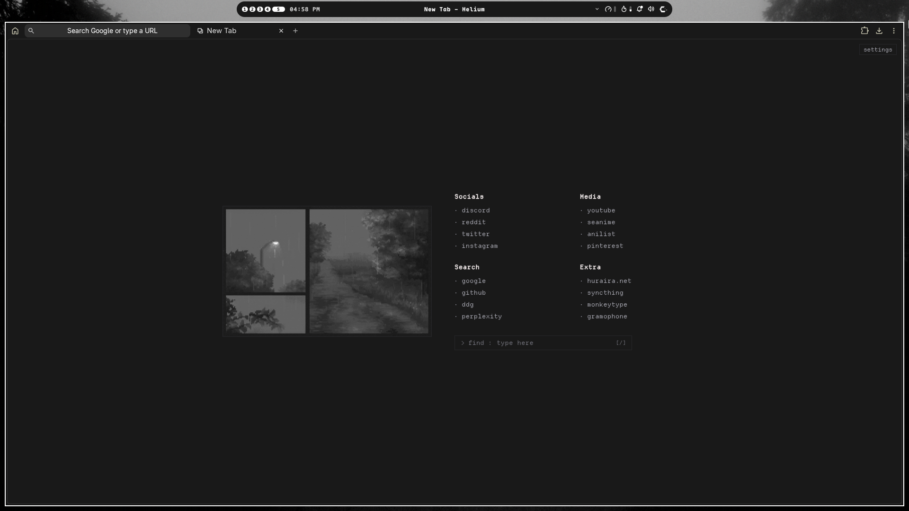

# chromium-newtab

a custom minimal new tab extension for Chromium-based browsers.

- Fully customizable
- Bangs support

## How to use

1. Clone or download this repository.
2. Open your browser and go to `chrome://extensions` (works on Brave, Edge, Helium, etc.).
3. Toggle on **Developer mode** in the top right.
4. Click **Load unpacked** and select the folder with this repository.
5. Open a new tab and enjoy.

## Credits

- Settings menu by [zyqunix](https://github.com/zyqunix)
- [Departure Mono](https://departuremono.com/) by Helena Zhang (SIL OFL 1.1)
- [Maple Mono](https://github.com/subframe7536/maple-font) by subframe7536 (SIL OFL 1.1)
